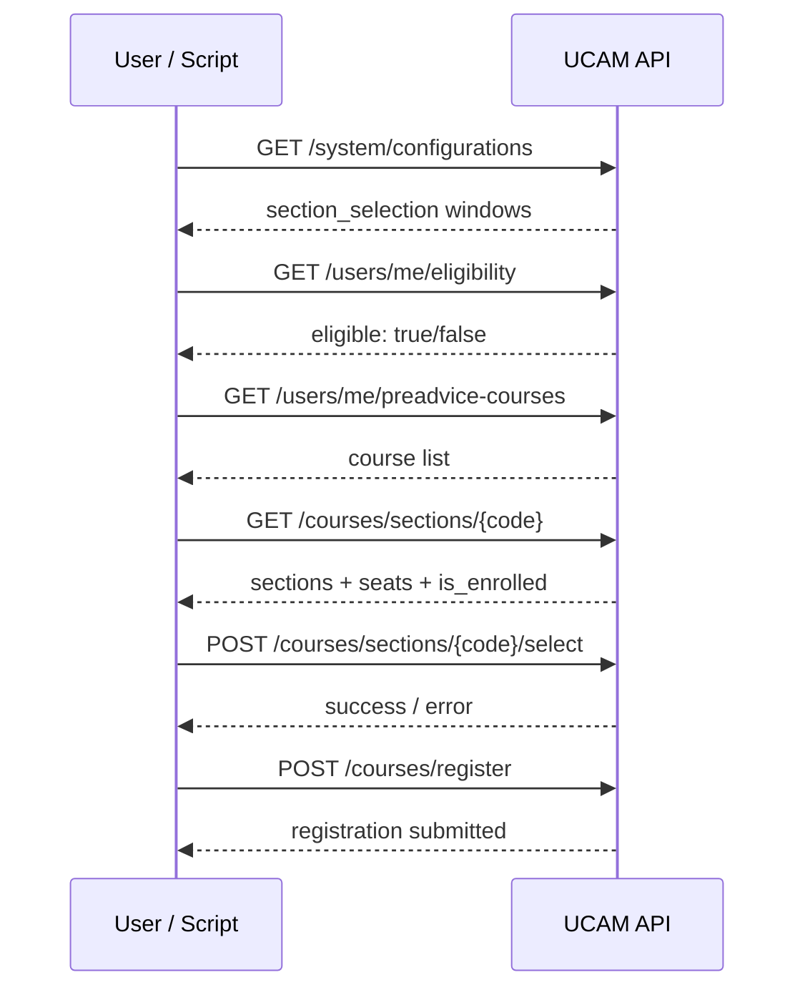

# UCAM Cloud — API, Security & Automation Notes

This document describes how **UIU UCAM Cloud** (`https://ucamcloud.uiu.ac.bd`) talks to its backend, what security controls exist, and how section selection works. It is based on reverse-engineering the public frontend (July 2026 build `b9e8c2a`) and captured API responses in this repo’s `tmp/` folder.

> **Disclaimer:** UCAM Cloud is an official university registration system. Automating it may violate UIU terms of service. This document is for understanding and personal tooling only. Use at your own risk.

---

## Architecture

```
Browser (ucamcloud.uiu.ac.bd)
        │
        │  HTTPS + Bearer JWT
        │  Origin / Referer / User-Agent
        ▼
AWS API Gateway
https://lxr6c7qhl1.execute-api.ap-southeast-1.amazonaws.com/v3
        │
        ├── Auth service
        ├── System / config
        ├── Users / pre-advice
        └── Courses / section selection
```

The SPA is served from `ucamcloud.uiu.ac.bd` (Cloudflare). JSON API calls go to the **execute-api** host above, not to paths under `/api/` on the portal domain.

---

## Response envelope

Every endpoint returns the same shape:

```json
{
  "status": "success",
  "data": {}
}
```

Or on failure:

```json
{
  "status": "error",
  "message": "missing token",
  "error": ""
}
```

Client code should treat `status !== "success"` as failure regardless of HTTP status code.

---

## Authentication

### Login (browser only — Turnstile required)

```http
POST /auth/login
Content-Type: application/json
Origin: https://ucamcloud.uiu.ac.bd

{
  "user_id": "0112330113",
  "password": "********",
  "logout_other_sessions": true,
  "turnstile_token": "<cloudflare-turnstile-response>"
}
```

**Sample error without captcha:**

```json
{
  "status": "error",
  "message": "captcha verification required"
}
```

**Sample success:**

```json
{
  "status": "success",
  "data": {
    "access_token": "eyJ...",
    "refresh_token": "eyJ..."
  }
}
```

The portal stores tokens in `localStorage`:

| Key                    | Purpose                                   |
| ---------------------- | ----------------------------------------- |
| `ucam-access-token`    | Short-lived JWT (~120 min)                |
| `ucam-refresh-token`   | Used to obtain new access tokens (~1 day) |
| `ucam-refresh-expires` | Refresh expiry metadata                   |

Public config (`tmp/pub.json`) shows Turnstile is enabled:

```json
{
  "auth": {
    "authentication_enabled": true,
    "turnstile_enabled": true,
    "turnstile_site_key": "0x4AAAAAADvDH1FsMw3LyqDb"
  }
}
```

### Token refresh

```http
POST /auth/refresh
Content-Type: application/json

{
  "refresh_token": "<ucam-refresh-token>"
}
```

Returns a new `access_token` and optionally a rotated `refresh_token`.

### Authenticated requests

All protected routes require:

```http
Authorization: Bearer <access_token>
Accept: application/json
Origin: https://ucamcloud.uiu.ac.bd
Referer: https://ucamcloud.uiu.ac.bd/
User-Agent: <browser UA>
```

### Session policy

From `tmp/conf.json`:

```json
{
  "auth": {
    "access_token_expiry_minutes": 120,
    "refresh_token_expiry_days": 1,
    "max_active_sessions_per_user": 1,
    "allow_concurrent_sessions": false
  }
}
```

**One device at a time.** Logging in elsewhere (or using a script with a fresh login) revokes the previous session. The portal banner warns users about this.

### Practical auth for scripts

Because login requires **Cloudflare Turnstile**, scripts should copy tokens from an already-logged-in browser session into `scripts/config.js`:

```js
auth: {
  access_token: "<paste from ucam-access-token>",
  refresh_token: "<paste from ucam-refresh-token>",
},
user_agent: "<paste from DevTools → Network → user-agent header>",
```

Or via environment:

```bash
export UCAM_ACCESS_TOKEN="..."
export UCAM_REFRESH_TOKEN="..."
just ucam-fetch
```

---

## System & configuration endpoints

### Public config (no auth)

```http
GET /system/public-config
```

**Maps to:** `tmp/pub.json`

Contains banner text, maintenance mode, auth/Turnstile flags. Safe to call without a token.

### Full config (auth required)

```http
GET /system/configurations
```

**Maps to:** `tmp/conf.json`

Key fields for section selection:

```json
{
  "section_selection_status": "open",
  "section_selection": {
    "011": {
      "is_open": true,
      "start_time": "2026-07-04T07:00:00Z",
      "end_time": "2026-07-06T17:59:00Z",
      "current_session": "summer26",
      "cloud_registration_open": true,
      "priority_enabled": true,
      "priority_credit_threshold": 100,
      "priority_early_access_seconds": 10800
    }
  },
  "fallback_session": "summer26"
}
```

**Priority students** (≥100 credits for dept `011`) get early access 3 hours before the regular window (`effective_start_time` on course detail).

---

## User endpoints

### Current user profile

```http
GET /users/me
```

**Maps to:** `tmp/features.json`

```json
{
  "status": "success",
  "data": {
    "id": "0112330113",
    "display_name": "Hamed Zurat Bin Hashem",
    "email": "hhashem2330113@bscse.uiu.ac.bd",
    "role": "student",
    "department": "011",
    "avatar_url": "5e4c1ce8-d866-49ff-8938-6c0bf6132519.jpg",
    "completed_credits": 91
  }
}
```

### Eligibility

```http
GET /users/me/eligibility
```

**Maps to:** `tmp/elig.json`

```json
{
  "status": "success",
  "data": {
    "id": "0112330113",
    "eligible": true,
    "evaluation_complete": true,
    "special_note": "",
    "role": "student",
    "department": "011"
  }
}
```

If `eligible` is `false`, the UI blocks section selection.

### Pre-advised courses

```http
GET /users/me/preadvice-courses
```

**Maps to:** `tmp/preadv.json`

```json
{
  "status": "success",
  "data": {
    "user_id": "0112330113",
    "running_session": "summer26",
    "courses": [
      {
        "course_code": "1306-1-1",
        "course_name": "Microprocessors and Microcontrollers",
        "formal_code": "CSE 4325",
        "credits": 3
      }
    ],
    "total_courses": 5,
    "total_credits": 11
  }
}
```

Only courses in this list can be section-selected.

---

## Course & section endpoints

### All sections for a department

```http
GET /courses/sections?department=011
```

**Maps to:** `res.json` (used by this repo’s class planner)

Returns every course in the department with full section lists, schedules, seat counts, faculty, etc.

### Single course detail

```http
GET /courses/sections/1306-1-1
```

**Maps to:** `tmp/1306.json` (slug = first segment of `course_code`)

```json
{
  "status": "success",
  "data": {
    "course_code": "1306-1-1",
    "course_name": "Microprocessors and Microcontrollers",
    "formal_code": "CSE 4325",
    "credits": 3,
    "running_session": "summer26",
    "have_mapped_sections": false,
    "mapped_section_ids": [],
    "sections": [
      {
        "section_id": "847d6a10-b3be-4efd-9a42-68839bcd4b5a",
        "section_name": "B",
        "faculty_name": "Md. Shafqat Talukder",
        "faculty_code": "MSTR",
        "room_details": "406",
        "schedule": [
          { "day": "Sunday", "start_time": "15:11", "end_time": "16:30" }
        ],
        "total_seats": 40,
        "seats_taken": 12,
        "is_enrolled": false,
        "stop_option_to_change_section": false
      }
    ],
    "selection_open": true,
    "section_selection_start_time": "2026-07-04T07:00:00Z",
    "section_selection_end_time": "2026-07-06T17:59:00Z",
    "is_priority_student": false,
    "effective_start_time": "2026-07-04T07:00:00Z"
  }
}
```

Before the window opens, `sections` may be empty and `selection_open: false`.

### Select / change / remove section

```http
POST /courses/sections/1306-1-1/select
Authorization: Bearer <token>
Content-Type: application/json

{
  "section_id": "847d6a10-b3be-4efd-9a42-68839bcd4b5a",
  "action": "select",
  "parent_course_code": "1306-1-1"
}
```

| Field                | Notes                                                                                                          |
| -------------------- | -------------------------------------------------------------------------------------------------------------- |
| `section_id`         | UUID from section list                                                                                         |
| `action`             | `"select"` or `"remove"`                                                                                       |
| `parent_course_code` | Usually the course you’re advising; for mapped/lab sections use the mapped course code when `isMapped` is true |

**Sample success:**

```json
{
  "status": "success",
  "data": {
    "message": "Section selected successfully"
  }
}
```

**No Turnstile** on this endpoint. Security is JWT + server-side validation (window open, seats available, eligibility, conflicts).

### Final registration

Separate step after all sections are chosen:

```http
POST /courses/register
Authorization: Bearer <token>
Content-Type: application/json

{}
```

---

## Section selection flow (end-to-end)



### When is selection “open”?

All must be true (see `scripts/lib/sections.js`):

1. Global `section_selection_status === "open"`
2. Department `section_selection[dept].is_open === true`
3. Current time within start/end window (respecting `effective_start_time` for priority)
4. Course-level `selection_open !== false`

---

## Security controls summary

| Control                  | Where                          | Affects scripts?                       |
| ------------------------ | ------------------------------ | -------------------------------------- |
| Cloudflare Turnstile     | `POST /auth/login` only        | Yes — cannot password-login headlessly |
| JWT Bearer auth          | All protected routes           | Yes — need valid token                 |
| Single session           | Config + login                 | Yes — one active login per user        |
| Token expiry             | 120 min access / 1 day refresh | Yes — refresh or re-copy tokens        |
| Eligibility gate         | Server + UI                    | Yes — ineligible users blocked         |
| Selection time window    | Server                         | Yes — requests rejected before open    |
| Seat limits              | Server                         | Yes — full sections reject             |
| Schedule conflict check  | Server + UI                    | Yes — conflicting sections flagged     |
| Real-time seat updates   | WebSocket on course page       | No — scripts poll GET instead          |
| Bot detection analysis   | Admin panel only               | Indirect — see below                   |
| Origin / Referer headers | API Gateway                    | Minor — scripts set portal origin      |
| User-Agent logging       | All requests                   | Non-browser UA flagged in bot analysis |

### What is NOT protected by Turnstile

- `POST /courses/sections/{code}/select`
- `POST /courses/register`
- All `GET` data endpoints
- `POST /auth/refresh`

---

## Bot detection (`/command/bot-detection`)

**Access:** super-admin role only (`role === "super"`). Not visible to students.

**Purpose:** Offline analysis tool for admins — **does not block requests in real time**. The UI states: _“Any action stays manual.”_

### API

```http
POST /system/analysis/bot-detection
Authorization: Bearer <super-admin-token>
Content-Type: application/json

{
  "department": "011",
  "running_session": "summer26",
  "force_refresh": false
}
```

### Response shape

```json
{
  "status": "success",
  "data": {
    "department": "011",
    "running_session": "summer26",
    "students_analyzed": 842,
    "total_actions": 15230,
    "flagged_count": 7,
    "from_cache": true,
    "suspicious_students": [
      {
        "student_id": "0112330113",
        "score": 72,
        "reasons": [
          "High action burst: 8 actions in 10s",
          "Bot-like user agent detected"
        ],
        "actions": 24,
        "select_count": 18,
        "change_count": 5,
        "remove_count": 1,
        "distinct_ips": 2,
        "ips": ["103.x.x.x", "27.x.x.x"],
        "user_agents": ["Bun/1.3.14", "Mozilla/5.0 ..."],
        "bot_user_agent": true,
        "min_gap_ms": 45,
        "median_gap_ms": 120,
        "gap_cv": 0.08,
        "max_burst_10s": 8,
        "first_action": "2026-07-04T07:00:01Z",
        "last_action": "2026-07-04T07:02:15Z"
      }
    ],
    "shared_ips": [
      {
        "ip": "103.55.x.x",
        "students": 12,
        "student_ids": ["011030404", "0112330113"]
      }
    ]
  }
}
```

> `reasons` text above is illustrative; exact strings are generated server-side.

### Score labels (UI)

| Score | Label    |
| ----- | -------- |
| ≥ 80  | Critical |
| ≥ 60  | High     |
| < 60  | Elevated |

### How data is collected

1. **Successful** section actions (`select`, `change`, `remove`) are logged with:
   - `student_id`
   - timestamp
   - client IP
   - User-Agent
   - action type

2. Backend computes timing statistics:
   - **min_gap_ms / median_gap_ms / gap_cv** — regular or very fast intervals suggest automation
   - **max_burst_10s** — many actions within 10 seconds

3. **bot_user_agent** — flags non-browser User-Agent strings (e.g. `Bun/...`, `python-requests/...`)

4. **shared_ips** — one IP associated with many student IDs (script farm vs campus NAT)

5. Results may be **cached**; `force_refresh: true` recomputes.

### Blind spot (documented in the UI)

The bot-detection panel **only analyzes successful actions**. It does **not** see:

- Hammering before selection opens
- Failed attempts on full sections
- Brute-force select errors

Those appear in **AWS CloudWatch Logs** on the Courses Lambda:

```
Log group: /aws/lambda/<stage>-CoursesDomain
```

**Sample CloudWatch Logs Insights query** (from the admin UI):

```
fields @timestamp, student_id, ip, ua, error
| parse ip "*, *" as client_ip, hop
| filter @message like /handle_select_section: failed/
| stats count() as attempts, earliest(@timestamp) as first, latest(@timestamp) as last
        by student_id, client_ip, ua
| sort attempts desc
```

Common failure messages in logs:

- `section selection has not started yet` — pre-open scripting
- `no seats available` — hammering a full section
- `handle_select_section: failed` — generic failure bucket

---

## Implications for automation

If you use `scripts/cli.js`:

| Risk signal          | Mitigation in config                                           |
| -------------------- | -------------------------------------------------------------- |
| `max_burst_10s`      | `select.min_delay_ms` (default 1500) between courses           |
| `min_gap_ms` too low | Avoid tight retry loops; use `retry_delay_ms: 800`             |
| `bot_user_agent`     | Set `user_agent` in `scripts/config.js` to your browser’s UA   |
| Pre-open failures    | `select.wait_until_open: true` — don’t POST before window      |
| Full-section spam    | Check `seats_taken < total_seats` before select; limit retries |
| Session revocation   | Don’t log in elsewhere while script runs                       |
| Token expiry         | Keep `refresh_token`; script auto-refreshes on 401             |

**Recommended workflow:**

1. Log in manually in the browser (passes Turnstile).
2. Copy both tokens and your browser UA to `scripts/config.js`.
3. Run `just ucam-fetch` to refresh `res.json` / `tmp/*`.
4. Test with `"dry_run": true` in config.
5. Run `just ucam-select` when the window is open.
6. Optionally set `"register_after": true` for final registration.

---

## Local file mapping (this repo)

| File                | API endpoint                           |
| ------------------- | -------------------------------------- |
| `tmp/pub.json`      | `GET /system/public-config`            |
| `tmp/conf.json`     | `GET /system/configurations`           |
| `tmp/features.json` | `GET /users/me`                        |
| `tmp/elig.json`     | `GET /users/me/eligibility`            |
| `tmp/preadv.json`   | `GET /users/me/preadvice-courses`      |
| `res.json`          | `GET /courses/sections?department=011` |
| `tmp/1306.json`     | `GET /courses/sections/1306-1-1`       |
| `tmp/1307.json`     | `GET /courses/sections/1307-1-1`       |
| …                   | one file per pre-advised course        |

Generated by:

```bash
just ucam-fetch
```

---

## Admin-only endpoints (reference)

Not usable with a student token. Listed for completeness from frontend routes:

| Route                                        | Purpose                           |
| -------------------------------------------- | --------------------------------- |
| `POST /system/analysis/bot-detection`        | Suspicious activity report        |
| `POST /courses/sections/{code}/admin-select` | Admin picks section for a student |
| `POST /courses/register/admin`               | Admin registration                |
| `GET /users/{id}/preadvice-courses`          | Admin view of student courses     |
| `GET /command/*`                             | Various admin dashboards          |

---

## curl examples

**Public config (no token):**

```bash
curl -s 'https://lxr6c7qhl1.execute-api.ap-southeast-1.amazonaws.com/v3/system/public-config' \
  -H 'Accept: application/json' \
  -H 'Origin: https://ucamcloud.uiu.ac.bd' | jq .
```

**Pre-advised courses:**

```bash
curl -s 'https://lxr6c7qhl1.execute-api.ap-southeast-1.amazonaws.com/v3/users/me/preadvice-courses' \
  -H "Authorization: Bearer $UCAM_ACCESS_TOKEN" \
  -H 'Accept: application/json' \
  -H 'Origin: https://ucamcloud.uiu.ac.bd' | jq .
```

**Select section B for Microprocessors:**

```bash
curl -s -X POST \
  'https://lxr6c7qhl1.execute-api.ap-southeast-1.amazonaws.com/v3/courses/sections/1306-1-1/select' \
  -H "Authorization: Bearer $UCAM_ACCESS_TOKEN" \
  -H 'Content-Type: application/json' \
  -H 'Origin: https://ucamcloud.uiu.ac.bd' \
  -d '{
    "section_id": "847d6a10-b3be-4efd-9a42-68839bcd4b5a",
    "action": "select",
    "parent_course_code": "1306-1-1"
  }' | jq .
```

---

## Related files in this repo

| Path                        | Role                                 |
| --------------------------- | ------------------------------------ |
| `scripts/cli.js`            | CLI entry (`fetch`, `select`, `all`) |
| `scripts/config.js`         | Config (tokens, UA, selections)      |
| `scripts/README.md`         | CLI usage                            |
| `scripts/lib/api.js`        | HTTP client                          |
| `scripts/lib/sections.js`   | Open-window logic, section matching  |
| `scripts/lib/select.js`     | Selection runner                     |
| `scripts/lib/fetch-data.js` | Downloads all JSON snapshots         |
| `main.js`                   | Class planner (reads `res.json`)     |

---

_Last updated: July 2026 — API base and behavior may change when UCAM Cloud is redeployed._
